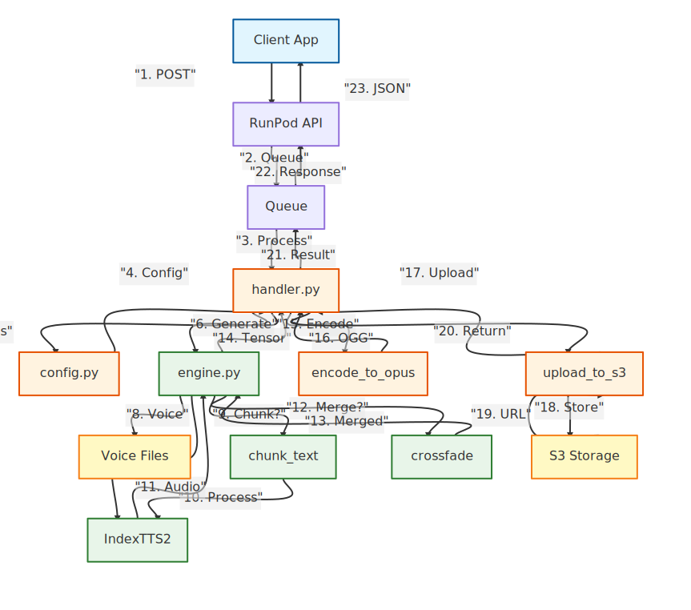

# IndexTTS RunPod Serverless

[](https://www.python.org/downloads/)
[](https://pytorch.org/)
[](https://opensource.org/licenses/MIT)
[](https://huggingface.co/IndexTeam/IndexTTS-2)

RunPod serverless worker for [IndexTTS](https://github.com/index-tts/index-tts) inference - An Industrial-Level Controllable and Efficient Zero-Shot Text-To-Speech System.

This repository provides a **RunPod serverless inference worker** that:
- Generates high-quality speech from text
- Supports voice cloning with reference audio
- Supports emotion control via emotion reference audio or emotion vectors
- Runs as a queue-based serverless worker on RunPod
- Uploads generated audio to S3-compatible storage

**Model:** [IndexTeam/IndexTTS-2](https://huggingface.co/IndexTeam/IndexTTS-2) | **Upstream Repo:** [index-tts/index-tts](https://github.com/index-tts/index-tts)

## ✨ Features

- **🎯 Voice Cloning**: Zero-shot voice cloning with a short reference audio sample
- **🎭 Emotion Control**: Control emotions via reference audio, emotion vectors, or text descriptions
- **🔬 High Quality**: State-of-the-art speech synthesis with natural prosody
- **⚡ Optimized**: FP16 support, chunking for long texts, crossfade for smooth transitions
- **📡 Stream Mode**: True streaming - each text chunk is synthesized and sent immediately as base64 PCM
- **☁️ Serverless**: RunPod queue-based worker, S3 uploads, persistent voice directory
- **🔧 Flexible**: Configurable generation parameters and chunking options

## 🏗️ Architecture

The RunPod serverless worker follows a modular architecture pattern:

| Module | Purpose |
|--------|---------|
| `handler.py` | Main RunPod handler - validates requests, routes to inference |
| `config.py` | Centralized configuration - environment variables, validation, constants |
| `serverless_engine.py` | Inference wrapper - model loading, generation, text chunking |

### Model Architecture

IndexTTS2 is an autoregressive TTS model with:
- **Duration Control**: First AR TTS with precise synthesis duration control
- **Emotion Decoupling**: Separate control over timbre and emotion
- **GPT Integration**: Uses GPT latent representations for emotional expressiveness
- **Multi-modal Input**: Supports speaker audio, emotion audio, emotion vectors, and text descriptions

### Request Flow



The diagram above illustrates the complete request lifecycle through numbered steps:
1. **Client POST** → Application sends HTTP POST to RunPod API
2. **Queue Job** → RunPod queues the request for processing
3. **Process** → Worker dequeues and processes the request
4. **Config** → Handler retrieves configuration settings
5. **Settings** → Config returns validated settings
6. **Generate** → Handler requests audio generation
7. **Load Model** → Engine loads IndexTTS2 model
8. **Voice** → Engine retrieves voice reference files
9. **Chunk?** → Engine checks if text needs chunking
10. **Process** → Chunks are processed through model
11. **Audio** → Model returns raw audio
12. **Merge?** → Engine checks if chunks need merging
13. **Merged** → Crossfade merges audio chunks
14. **Tensor** → Engine returns audio tensor
15. **Encode** → Handler encodes to Opus/OGG
16. **OGG** → Encoder returns encoded audio
17. **Upload** → Handler uploads to S3
18. **Store** → S3 stores the audio file
19. **URL** → S3 returns presigned URL
20. **Return** → Upload returns URL to handler
21. **Result** → Handler returns job result
22. **Response** → Queue responds to API
23. **JSON** → Client receives final response

## 🚀 Quick Start

### Prerequisites

1. RunPod account with Serverless enabled
2. S3-compatible storage (e.g., Backblaze B2, AWS S3, Cloudflare R2)
3. (Optional) HuggingFace token for gated model downloads

### Environment Variables

| Variable | Description | Required |
|----------|-------------|----------|
| `HF_TOKEN` | HuggingFace token for model download | Recommended |
| `S3_ENDPOINT_URL` | S3-compatible endpoint URL | Yes |
| `S3_ACCESS_KEY_ID` | S3 access key | Yes |
| `S3_SECRET_ACCESS_KEY` | S3 secret key | Yes |
| `S3_BUCKET_NAME` | S3 bucket name | Yes |
| `S3_REGION` | S3 region (default: us-east-1) | No |
| `AUDIO_VOICES_DIR` | Directory for voice reference files | No |
| `OUTPUT_AUDIO_DIR` | Directory for output audio | No |
| `CHECKPOINTS_DIR` | Directory for model checkpoints | No |
| `USE_FP16` | Enable FP16 inference (default: false) | No |
| `USE_DEEPSPEED` | Enable DeepSpeed (default: false) | No |
| `USE_CUDA_KERNEL` | Enable CUDA kernel (default: false) | No |
| `MAX_TOKENS_PER_SEGMENT` | Max tokens per segment (default: 800) | No |

### Building the Docker Image

```bash
docker build -t indextts-runpod .
```

### Deploying to RunPod

1. Push your image to a container registry (Docker Hub, GitHub Container Registry, etc.)
2. Create a new Serverless endpoint on RunPod
3. Configure the environment variables above
4. Upload voice reference files to `/runpod-volume/indextts/audio_voices/`

## 📖 API Usage

### Request Format

```json
{
  "input": {
    "text": "Hello, this is a test of IndexTTS voice cloning!",
    "speaker_voice": "reference_voice.wav",
    "emo_alpha": 0.8,
    "enable_chunking": true,
    "max_chars_per_chunk": 300,
    "enable_crossfade": true,
    "crossfade_ms": 140
  }
}
```

### Request Parameters

| Parameter | Type | Description | Default |
|-----------|------|-------------|---------|
| `text` | str | **Required.** Text to synthesize | - |
| `speaker_voice` | str | Voice reference audio filename (in AUDIO_VOICES_DIR) | None |
| `emo_audio_prompt` | str | Emotion reference audio filename | None |
| `emo_vector` | list[float] | Emotion vector [happy, angry, sad, afraid, disgusted, melancholic, surprised, calm] | None |
| `emo_alpha` | float | Emotion strength (0.0-1.0) | 1.0 |
| `use_emo_text` | bool | Use text for emotion guidance | false |
| `emo_text` | str | Emotion text description | None |
| `use_random` | bool | Enable randomness in generation | false |
| `enable_chunking` | bool | Split long text into chunks | true |
| `max_chars_per_chunk` | int | Max characters per chunk (50-1000) | 300 |
| `enable_crossfade` | bool | Apply crossfade between chunks | true |
| `crossfade_ms` | int | Crossfade duration in ms | 140 |
| `chunk_pause_ms` | int | Silence gap between chunks in ms (0-2000) | 300 |
| `stream` | bool | Enable streaming mode (base64 `pcm_16` chunks) | false |
| `output_format` | str | Streaming format (currently only `pcm_16`) | `pcm_16` |
| `stream_max_chars_per_chunk` | int | Override stream chunk text size (smaller = faster first audio) | 150 |
| `stream_crossfade_ms` | int | Override stream crossfade duration in ms | uses `crossfade_ms` |
| `session_id` | str | Custom session ID for filename | UUID |

### Response Format

```json
{
  "status": "completed",
  "filename": "abc123.ogg",
  "url": "https://s3.example.com/bucket/abc123.ogg?...",
  "s3_key": "abc123.ogg",
  "metadata": {
    "sample_rate": 24000,
    "codec": "opus",
    "bitrate": "128k",
    "duration": 3.45,
    "device": "cuda",
    "speaker_voice": "reference_voice.wav",
    "emo_alpha": 0.8
  }
}
```

### Streaming Response Format

When `stream=true`, the handler yields audio chunks **immediately as each text chunk finishes inference**. The client receives first audio after the first chunk generates (~2-3s), rather than waiting for all chunks to complete.

Poll the RunPod stream endpoint (`/stream/{job_id}`) to receive chunks as they become available:

```json
{
  "status": "streaming",
  "chunk": 1,
  "format": "pcm_16",
  "audio_chunk": "BASE64_INT16_PCM...",
  "sample_rate": 22050
}
```

The final yield signals completion:

```json
{
  "status": "complete",
  "format": "pcm_16",
  "total_chunks": 5
}
```

**Client polling pattern:** Keep polling `/stream/{job_id}` until job status is `COMPLETED`. Each poll returns only new chunks since the last call. Empty responses mean the next chunk is still generating — do not stop polling.

### Example API Calls

#### Basic Voice Cloning

```bash
curl -X POST "https://api.runpod.ai/v2/${ENDPOINT_ID}/runsync" \
  -H "Content-Type: application/json" \
  -H "Authorization: Bearer ${RUNPOD_API_KEY}" \
  -d '{
    "input": {
      "text": "Hello, this is a cloned voice speaking!",
      "speaker_voice": "my_voice.wav"
    }
  }'
```

#### With Emotion Control

```bash
curl -X POST "https://api.runpod.ai/v2/${ENDPOINT_ID}/runsync" \
  -H "Content-Type: application/json" \
  -H "Authorization: Bearer ${RUNPOD_API_KEY}" \
  -d '{
    "input": {
      "text": "I am so happy to talk to you today!",
      "speaker_voice": "my_voice.wav",
      "emo_vector": [0.8, 0, 0, 0, 0, 0, 0.2, 0],
      "emo_alpha": 0.7
    }
  }'
```

#### With Text-based Emotion

```bash
curl -X POST "https://api.runpod.ai/v2/${ENDPOINT_ID}/runsync" \
  -H "Content-Type: application/json" \
  -H "Authorization: Bearer ${RUNPOD_API_KEY}" \
  -d '{
    "input": {
      "text": "This is terrifying news!",
      "speaker_voice": "my_voice.wav",
      "use_emo_text": true,
      "emo_text": "I am scared and afraid!",
      "emo_alpha": 0.6
    }
  }'
```

#### Long Text with Chunking

```bash
curl -X POST "https://api.runpod.ai/v2/${ENDPOINT_ID}/runsync" \
  -H "Content-Type: application/json" \
  -H "Authorization: Bearer ${RUNPOD_API_KEY}" \
  -d '{
    "input": {
      "text": "This is a very long text that will be automatically split into multiple chunks...",
      "speaker_voice": "my_voice.wav",
      "enable_chunking": true,
      "max_chars_per_chunk": 250,
      "enable_crossfade": true,
      "crossfade_ms": 140
    }
  }'
```

#### Streaming Mode (PCM Chunks)

Use the `/run` endpoint (not `/runsync`) and poll `/stream/{job_id}` for chunks:

```bash
# Start the streaming job
curl -X POST "https://api.runpod.ai/v2/${ENDPOINT_ID}/run" \
  -H "Content-Type: application/json" \
  -H "Authorization: Bearer ${RUNPOD_API_KEY}" \
  -d '{
    "input": {
      "text": "This response is streamed in chunks as each sentence is generated.",
      "speaker_voice": "my_voice.wav",
      "stream": true
    }
  }'

# Poll for chunks (repeat until job status is COMPLETED)
curl "https://api.runpod.ai/v2/${ENDPOINT_ID}/stream/${JOB_ID}" \
  -H "Authorization: Bearer ${RUNPOD_API_KEY}"
```

#### Health Check

```bash
curl -X POST "https://api.runpod.ai/v2/${ENDPOINT_ID}/runsync" \
  -H "Content-Type: application/json" \
  -H "Authorization: Bearer ${RUNPOD_API_KEY}" \
  -d '{
    "input": {
      "action": "health_check"
    }
  }'
```

## 📁 Directory Structure

```
/runpod-volume/indextts/
├── audio_voices/          # Voice reference files
│   ├── my_voice.wav
│   └── emotion_happy.wav
├── output_audio/          # Generated audio (temporary)
├── checkpoints/           # Model checkpoints
│   ├── config.yaml
│   ├── bigvgan.bin
│   └── ...
└── bootstrap.log          # Bootstrap log
```

## ⚙️ Configuration

### Adding Voice References

Upload audio files to the `AUDIO_VOICES_DIR` (default: `/runpod-volume/indextts/audio_voices/`):

1. Via RunPod volume browser
2. Via S3 sync at startup
3. Via custom bootstrap script

Supported formats: `.wav`, `.mp3`, `.m4a`, `.ogg`, `.flac`, `.webm`, `.aac`, `.opus`

### Performance Tuning

| Setting | Effect | Recommendation |
|---------|--------|----------------|
| `USE_FP16=true` | 2x faster, ~50% less VRAM | Enable on RTX 30xx+ |
| `USE_DEEPSPEED=true` | May speed up inference | Test on your hardware |
| `MAX_TOKENS_PER_SEGMENT=600` | Lower VRAM usage | For 8GB GPUs |
| `MAX_TOKENS_PER_SEGMENT=1200` | Higher quality | For 16GB+ GPUs |

### VRAM Requirements

| Configuration | VRAM Usage |
|--------------|------------|
| Default (FP32) | ~10-12 GB |
| FP16 | ~6-8 GB |
| FP16 + Low tokens | ~4-6 GB |

## 🛠️ Development

### Local Testing

```bash
# Set environment variables
export HF_TOKEN="your_token"
export S3_ENDPOINT_URL="..."
# ... etc

# Run handler directly
python handler.py

# Or run with warmup
python handler.py --warmup
```

### Building with Custom Model

To use a custom model or mirror:

```dockerfile
ARG INDEXTTS_REPO="https://github.com/your-org/index-tts-fork.git"
ARG INDEXTTS_REF="feature-branch"
```

## 📚 References

- [IndexTTS GitHub Repository](https://github.com/index-tts/index-tts)
- [IndexTTS-2 HuggingFace Model](https://huggingface.co/IndexTeam/IndexTTS-2)
- [RunPod Serverless Documentation](https://docs.runpod.io/serverless/overview)
- [IndexTTS Paper (arXiv)](https://arxiv.org/abs/2502.05512)
- [IndexTTS2 Paper (arXiv)](https://arxiv.org/abs/2506.21619)

## 📄 License

This project is licensed under the MIT License. The IndexTTS model has its own license terms - please refer to the upstream repository for details.

## 🙏 Acknowledgements

- [index-tts/index-tts](https://github.com/index-tts/index-tts) - The IndexTTS team at Bilibili
- [RunPod](https://runpod.io) - Serverless GPU infrastructure
- Based on the Echo-TTS serverless pattern
